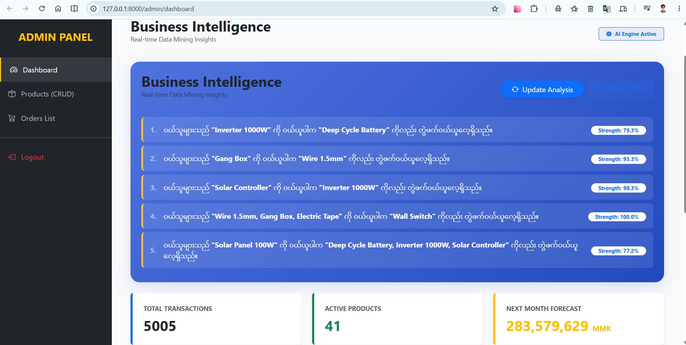
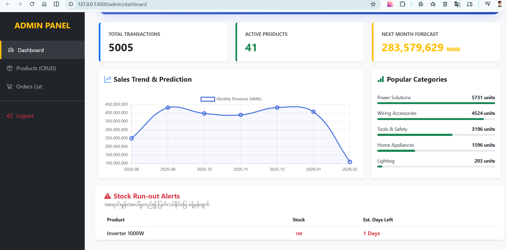
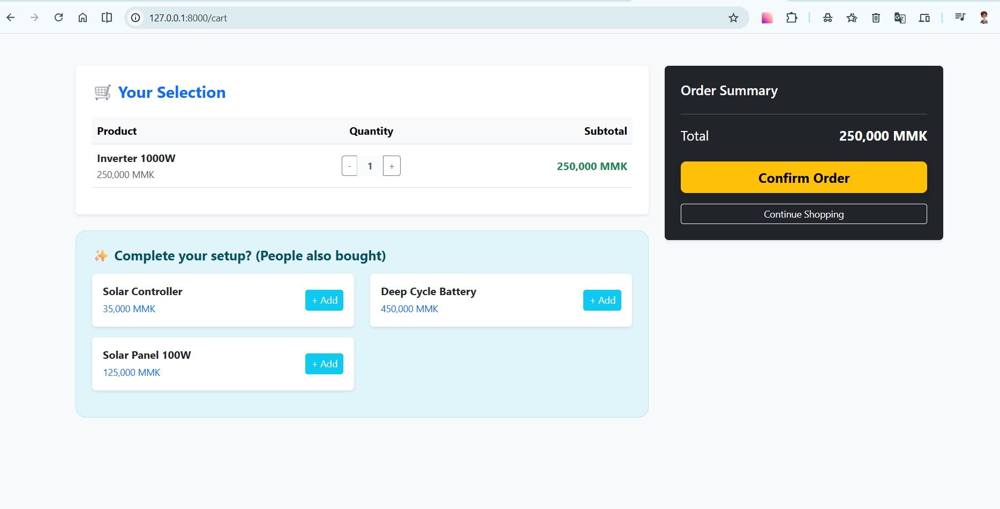

# Electrical POS - Market Basket Analysis

> AI-powered Electrical Shop POS with intelligent product recommendations powered by FP-Growth data mining.


---

## Overview

Electrical POS is a full-stack Point of Sale web application designed for electrical supply shops. It combines standard e-commerce POS functionality (customer-facing storefront, cart, checkout, and admin management) with an embedded **Market Basket Analysis** engine that uses the **FP-Growth algorithm** to discover hidden product relationships from transaction history. The system automatically mines data every midnight and surfaces AI-powered recommendations to both customers and admins.

---

## Key Features

| Feature | Description |
|---|---|
| **Customer Storefront** | Browse products by category, view details, and add to cart |
| **Shopping Cart** | Session-based cart with quantity controls and real-time totals |
| **AI Recommendations** | "Frequently Bought Together" suggestions powered by association rules |
| **Admin Dashboard** | Business Intelligence panel with KPIs, sales trends, category breakdown, and stock alerts |
| **Sales Prediction** | Linear Regression forecast for next-month revenue |
| **Product Management** | Full CRUD (Create, Read, Update, Delete) for inventory with image upload |
| **Order Management** | View orders, update status (Pending → Completed / Cancelled) with automatic stock deduction |
| **Auto Mining** | Background job runs FP-Growth every midnight and updates `recommendation_rules` |

---

## Technology Stack

- **Backend:** Flask (Python)
- **Database:** MySQL
- **Frontend:** Bootstrap 5, Chart.js
- **Data Mining:** `mlxtend` (FP-Growth, Association Rules)
- **Numerical:** NumPy
- **Scheduling:** APScheduler
- **Security:** Werkzeug password hashing, session-based auth

---

## Project Structure

```
electronic_pos_market_basket/
├── app.py                        # Main Flask application
├── db_and_tables_creation.py     # Database schema + 40 sample products + 2000 transactions
├── adding_sampledata.py          # Adds 3000 additional transactions over last 6 months
├── change_tran_date.py           # Utility to adjust transaction dates
├── mining_engine.py              # FP-Growth mining engine & rule persistence
├── mining_basket_v2.ipynb        # Jupyter notebook for experimenting with mining params
├── templates/
│   ├── index.html                # Customer storefront (product listing)
│   ├── product.html              # Product detail + AI recommendations
│   ├── cart.html                 # Shopping cart + recommendations
│   └── admin/
│       ├── layout.html           # Admin base layout
│       ├── login.html            # Admin login page
│       ├── dashboard.html        # BI dashboard with charts & mining insights
│       ├── products.html         # Product inventory (CRUD)
│       └── orders.html           # Order list & status management
└── static/
    └── uploads/
        └── products/             # Product images
```

---

## Setup Instructions

### 1. Prerequisites

Ensure you have the following installed:

- Python 3.8+
- MySQL Server (running on `localhost`)
- A virtual environment (recommended)

### 2. Clone the Repository

```bash
git clone https://github.com/wailinnaing432019/electronic_pos_market_basket.git
cd electronic_pos_market_basket
```

### 3. Create and Activate Virtual Environment

```bash
# Windows
venv\Scripts\Activate

# macOS / Linux
source venv/bin/activate
```

### 4. Install Dependencies

```bash
pip install flask mysql-connector-python numpy mlxtend pandas apscheduler werkzeug
```

### 5. Configure Database

- Start MySQL service.
- Open `db_and_tables_creation.py` and verify the connection settings (default: `host=localhost`, `user=root`, `password=""`).
- Run the script to create the database and seed initial data:

```bash
python db_and_tables_creation.py
```

This creates:
- 5 categories (Power Solutions, Lighting, Wiring Accessories, Home Appliances, Tools & Safety)
- 40 products
- 2,000 patterned transactions

Optional: Add 3,000 more transactions spread over the last 6 months:

```bash
python adding_sampledata.py
```

### 6. Run the Application

```bash
python app.py
```

The app starts on **http://localhost:8000**

- **Customer Storefront:** http://localhost:8000/
- **Admin Login:** http://localhost:8000/admin/login
- **Admin Dashboard:** http://localhost:8000/admin/dashboard

---

## How to Use

### Customer Flow

1. Browse products on the home page, organized by category.
2. Click **Add to Cart** on any product.
3. View your cart, adjust quantities, and see AI-powered "People also bought" recommendations.
4. Click **Confirm Order** to place the order.

### Admin Flow

1. Log in at `/admin/login`.
2. **Dashboard:** View total transactions, active products, next-month revenue forecast (Linear Regression), sales chart, popular categories, and low-stock alerts.
3. **Products:** Add, edit, or delete products with image uploads.
4. **Orders:** View all orders and update their status. When marked **Completed**, stock is automatically deducted.
5. **Run Mining:** Click **Update Analysis** to manually trigger FP-Growth mining at any time (otherwise runs automatically at midnight).

---

## AI & Data Mining Details

The `MiningEngine` class in `mining_engine.py` performs the following steps:

1. **Extract:** Pulls completed transactions from the last 6 months.
2. **Preprocess:** Creates a one-hot encoded basket matrix (Transaction × Product).
3. **Mine:** Runs **FP-Growth** (`min_support=0.01`) to find frequent itemsets.
4. **Rule Generation:** Generates association rules filtered by `lift >= 1`.
5. **Persist:** Clears `recommendation_rules` and inserts the top rules ordered by confidence.

**Mining Schedule:** Runs automatically every midnight via APScheduler.

---

## Screenshots

### Admin Dashboard
Business Intelligence overview with KPIs, sales trend chart, category breakdown, and low-stock alerts.


### Admin Dashboard (Rules Section)
AI-generated association rules showing products frequently bought together.


### Shopping Cart
Customer cart page with quantity controls and AI-powered recommendations.


---

## Notes

- The default DB password is empty (`""`). Update `db_and_tables_creation.py`, `mining_engine.py`, and `app.py` if your MySQL root password differs.
- The `secret_key` in `app.py` should be changed for production.
- For first-time AI recommendations, run **Run Mining** manually after placing some test orders, or wait for the midnight auto-run.
- All prices are in **MMK** (Myanmar Kyat).

---

## Author

Built by [wailinnaing432019](https://github.com/wailinnaing432019)
